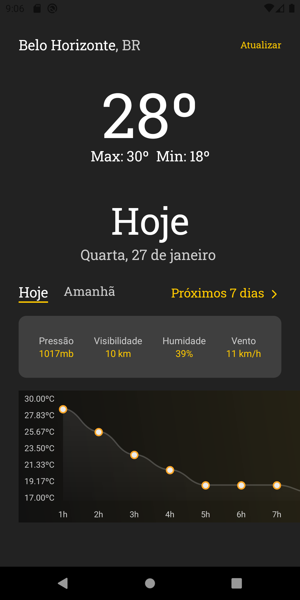
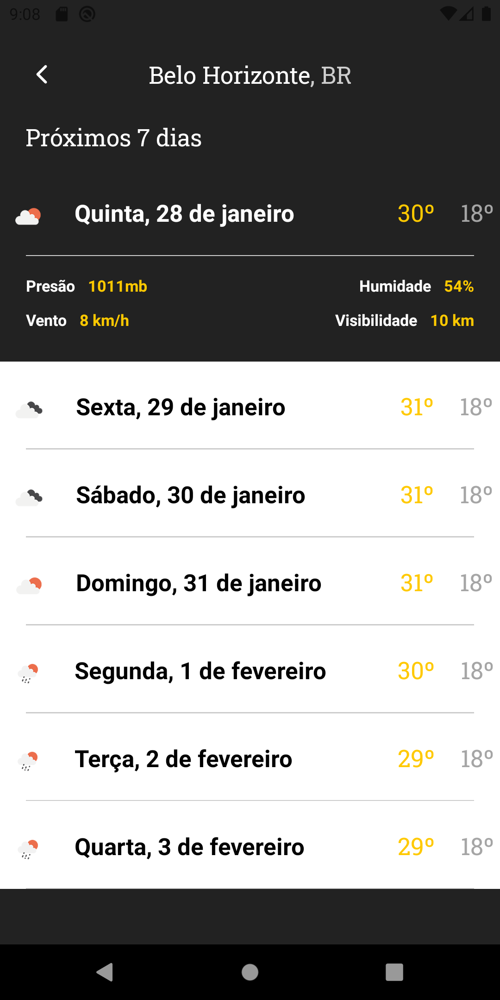

<h1 align="center">
    
</h1>
 <p align="center">Previsão do tempo para sua localização.</p>
<p align="center">
  <a href="https://github.com/guilhermediasm/chocolateweather/commits/master">
    
  </a>

  
</p>

<br>


## 📱 Desing do projeto

<p align="center">
  
   
</p>


## 🚀 Libs

Entre as tecnologias utilizadas, destaca-se:

- [Styled Components](https://styled-components.com/)
- [TypeScript](https://www.typescriptlang.org/)
- [React Native](https://facebook.github.io/react-native/)
- [React Navigation](https://reactnavigation.org/)
- [Yarn](https://yarnpkg.com/)
- [date-fns](https://date-fns.org/)
- [Axios](https://github.com/axios/axios)
- [OpenWeatherMap API](https://openweathermap.org/)
- [Mobx](https://mobx.js.org/)
- [React Native Size Matters](https://github.com/nirsky/react-native-size-matters)


### 💻 Build

```bash
# Clone this repository
$ git clone https://github.com/guilhermediasm/chocolateweather.git

# Go into the repository
$ cd chocolateweather

# Install dependencies
$ yarn

# Install pods
$ cd .\ios
$ pod install
$ cd ..

# Start
$ yarn start

```


## 🤗 Como contribuir?

- Faça um fork desse repositório;
- Cria uma branch com a sua feature: `git checkout -b name-feature`;
- Faça commit das suas alterações: `git commit -m 'feat: new feature'`;
- Faça push para a sua branch: `git push -u origin name-feature`.

Depois que o merge da sua pull request for feito, você pode deletar a sua branch.

## :memo: Licença

Esse projeto está sob a licença MIT. Veja o arquivo [LICENSE](LICENSE) para mais detalhes.

---

Feito com ❤ &nbsp;by Guilherme Dias Maria.
